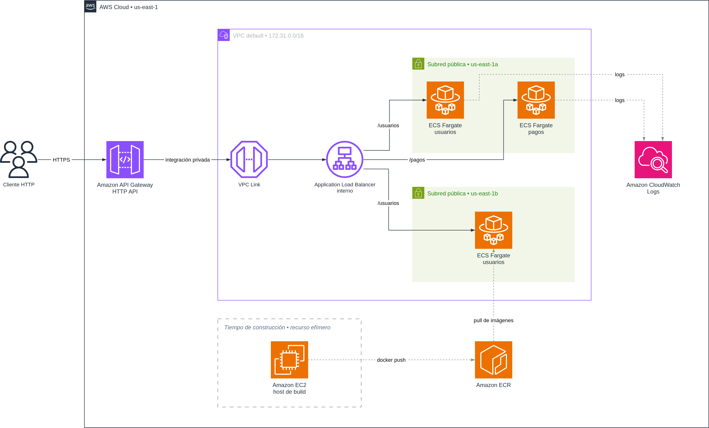

# Portafolio de arquitectura cloud

Soy Patricio Villarroel. Diseño y construyo productos digitales desde hace más de veinte años, y desde el diseño gráfico y de interfaces me moví hacia desarrollo, calidad y producto. Este portafolio reúne los proyectos de arquitectura cloud sobre AWS que desarrollé durante el bootcamp Fundamentos de Arquitectura Cloud.

Todos los proyectos se implementaron por consola en una cuenta AWS propia, no en un laboratorio. Cada uno está documentado con sus decisiones de diseño, incluyendo las que tomé por restricción de presupuesto y las que hoy resolvería distinto.

**Contacto:** [LinkedIn](https://www.linkedin.com/in/patvillarroel/) · [X](https://x.com/patvillarroel_) · [Perfil en GitHub](https://github.com/patvillarroel)

---

## Competencias técnicas

| Área | Herramientas |
|---|---|
| Cómputo y contenedores | EC2, ECS sobre Fargate, ECR, Lambda, Docker |
| Datos | RDS PostgreSQL, DynamoDB, S3, SQL |
| Red y entrega | VPC, subredes, grupos de seguridad, ALB, API Gateway, VPC Link, CloudFront |
| Integración asíncrona | SQS, SNS |
| Observabilidad | CloudWatch Logs, alarmas, CloudWatch Logs Insights |
| Desarrollo | Node.js, Python, JavaScript, Astro |
| Diseño y documentación | draw.io con simbología AWS, Figma, documentación técnica |

---

## Proyectos

### 1. Infraestructura Viva

**Migración de un entorno on-premise a AWS.** Propuesta completa para una empresa ficticia, cubriendo ocho dominios de una arquitectura cloud: almacenamiento, base de datos relacional, base de datos NoSQL, cómputo, red, mensajería, distribución web y monitoreo.

El diseño separa dos planos de entrada y un flujo asíncrono. El plano estático entrega contenido desde S3 a través de CloudFront, con el bucket privado y acceso controlado por OAC. El plano dinámico entra por un balanceador hacia instancias EC2 en subred privada, contra RDS PostgreSQL. El flujo asíncrono va de SQS a Lambda, y de ahí a DynamoDB con notificación por SNS.

`S3` `CloudFront` `EC2` `ALB` `RDS` `SQS` `Lambda` `DynamoDB` `SNS` `CloudWatch`

**[Ver repositorio →](https://github.com/patvillarroel/sence-infraestructura-viva)**

---

### 2. MicroPay: microservicios orquestados

**Migración de un monolito a microservicios para una fintech de pagos.** Dos servicios independientes, usuarios y pagos, contenerizados y publicados en ECR, desplegados como servicios separados en ECS sobre Fargate y repartidos en dos zonas de disponibilidad.

La pieza que define la arquitectura es que el balanceador no tiene dirección pública. El único componente alcanzable desde internet es el API Gateway, que llega a la red privada por un VPC Link. Un punto de entrada único solo existe si el resto está cerrado.

`ECS` `Fargate` `ECR` `Docker` `API Gateway` `VPC Link` `ALB interno` `IAM` `CloudWatch` `Node.js`

**[Ver repositorio →](https://github.com/patvillarroel/sence-micropay-microservicios)**

---

### 3. drawio-aws-reference

**Herramienta propia, nacida de un problema del propio trabajo.** Cada diagrama de arquitectura que necesitaba entregar en draw.io fallaba por lo mismo: nombres de estencil escritos de memoria que no existen en la librería AWS, y que se descubren recién al abrir el archivo.

Construí un paquete de referencia con los nombres verificados del set de formas AWS 2026, más un validador en Python que revisa el archivo antes de entregarlo. Es la diferencia entre revisar a ojo y tener una prueba que corre.

`Python` `XML` `draw.io` `simbología AWS 2026`

**[Ver repositorio →](https://github.com/patvillarroel/drawio-aws-reference)**

---

## Caso de estudio: MicroPay

### De qué se trataba

MicroPay es una fintech que opera sobre un sistema monolítico. No puede liberar funcionalidades sin desplegar todo, y se congestiona en los peaks de uso. La tarea fue diseñar e implementar la arquitectura de microservicios que reemplaza a ese monolito, con dos servicios independientes sobre AWS, expuestos por una puerta de entrada única.

### El desafío principal

El desafío no fue partir el monolito en dos. Fue que el aislamiento se pudiera demostrar y no solo afirmar.

El patrón de API Gateway se implementa habitualmente dejando el balanceador con dirección pública, confiando en que nadie la va a usar directamente. Eso entrega una puerta principal muy prolija y una puerta trasera abierta. Decidí no confiar, y esa decisión arrastró todo lo demás: un VPC Link para entrar a la red privada, una cadena de grupos de seguridad que se referencian entre ellos, y una prueba explícita de que la conexión directa al balanceador muere por tiempo de espera.

A eso se sumó una restricción de entorno. No tengo Docker en mi máquina y el equipo no tiene capacidad para correrlo, así que no podía construir las imágenes localmente.

### La solución

Dos servicios HTTP en Node.js, uno por capacidad de negocio, contenerizados sobre `node:24-alpine` y publicados como imágenes privadas en ECR. Cada uno corre como un servicio independiente de un clúster ECS sobre Fargate, con su propia definición de tarea y su propio grupo de destino.

El tráfico entra solo por API Gateway, viaja por VPC Link hasta un balanceador interno, y el balanceador rutea por ruta hacia el servicio que corresponde. Cada servicio escribe en su propio grupo de CloudWatch Logs.

Para el problema de la construcción de imágenes, levanté una instancia EC2 temporal como máquina de construcción. La decisión trajo dos beneficios que no había anticipado: la instancia corre en la misma arquitectura que las tareas de Fargate, lo que elimina el riesgo de publicar una imagen que no arranca, y en lugar de configurar claves de larga duración en mi equipo le asigné a la instancia un perfil de IAM. Las credenciales viven en el rol, se rotan solas y desaparecen cuando la instancia se termina.

### Herramientas y servicios

Amazon ECS sobre Fargate, Amazon ECR, Amazon API Gateway (HTTP API), VPC Link, Application Load Balancer interno, Amazon EC2, IAM, Amazon CloudWatch Logs y Logs Insights, Docker, Node.js, y draw.io para la documentación de arquitectura.

### Métricas

| Indicador | Resultado |
|---|---|
| Superficie expuesta a internet | Un solo componente. El balanceador resuelve a direcciones privadas, no enrutables |
| Distribución | Tareas repartidas automáticamente en dos zonas de disponibilidad |
| Latencia de aplicación | Bajo 1 ms, medida en CloudWatch, contra cientos de ms de la llamada completa |
| Tamaño de imagen | 61 MB, sin npm y con usuario no root |
| Escaneo de vulnerabilidades | Cero hallazgos en las cinco severidades del escaneo básico de ECR |
| Costo evitado | Cerca de USD 32 mensuales de NAT Gateway, resueltos con grupos de seguridad encadenados |
| Ruido en registros | Sondas de salud excluidas: más de cien líneas por tarea por hora que no describen tráfico real |

### Aprendizajes

**La coordinación cuesta más que las partes.** Exponer dos servicios que suman menos de cien líneas de código requirió tres grupos de seguridad, dos grupos de destino, un balanceador, un VPC Link y una API con cuatro rutas. Ese es el precio de entrada de los microservicios y se paga completo aunque haya solo dos. El beneficio empieza a rendir cuando son quince servicios y cada equipo despliega el suyo sin coordinarse.

**Las mediciones desmienten las intuiciones.** Esperaba la latencia repartida entre aplicación y red. La medición mostró la aplicación respondiendo en menos de un milisegundo y la llamada completa demorando cientos. Toda la latencia vive en las capas que agregué, no en el código.

**Dos escáneres pueden contradecirse y tener razón los dos.** El del entorno de desarrollo reportaba vulnerabilidades críticas donde el de ECR reportaba cero. Uno revisa dependencias de aplicación y el otro solo paquetes del sistema. Un resultado limpio nunca significa que no haya problema, significa que ese instrumento no mira ahí.

**Las restricciones empujaron a mejores decisiones.** No poder correr Docker en local terminó resolviendo la coincidencia de arquitectura y eliminando las credenciales de larga duración. Un entorno sin límites habría producido un diseño con las mismas debilidades y sin ninguna de ellas documentada.

### Por qué elegí este proyecto

Porque es el único donde el diseño se tuvo que probar. En los demás proyectos entregué una arquitectura argumentada. En este entregué una arquitectura donde el argumento central, que hay una sola puerta de entrada, se verifica con una prueba que cualquiera puede repetir.

También porque es el proyecto con más errores registrados. Cambié la imagen base a mitad de camino, un contenedor mal nombrado necesitó dos revisiones, y una decisión de red quedó documentada como un compromiso que en producción no tomaría. Registrar eso dice más sobre cómo trabajo que un relato donde todo salió a la primera.
